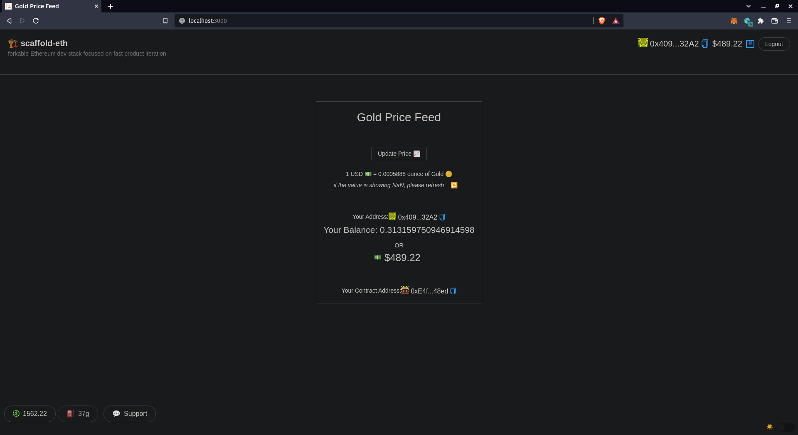

# Gold Price Feed using Scaffold ETH

You must have a [metamask](https://metamask.io/) wallet and some `Goerli` tokens, and `LINK` tokens as well to test this app.
* Create and get started with [meta mask](https://metamask.io/)
* Get some `Goerli` eth from [Goerli Faucet](https://goerlifaucet.com/)
* Get some `Link` toke as well to fund the contract so it can make api calls - [Chainlink Faucet](https://faucets.chain.link)

## Introduction

This contract fetchs the latest price of the gold from `metals-api.com` in terms of USD and displays it, comparatively to the user. Initally the price is set to outdated value of gold (at time the project was last updated), but user can get the latest price by clicking `Update Price 📈`.

## Getting Started

* clone this repo

```
git clone https://github.com/priyanshu87694/Gold-Price-Feed-Scaffold-Eth.git
```

* install all the packeges - `yarn install`

## Chainlink packages

* This contract is using chainlink's api call service make sure to add @chainlink/contract

```
yarn add @chainlink/contracts
```

## Working

* Start the development server

    ```
    yarn start
    ```

* Deploy the contract

    ```
    yarn deploy --tags goldPriceFeed --network goerli
    ```

* After deploying the contract don't forget to fund it with the `LINK` token
    [check here](https://docs.chain.link/docs/fund-your-contract/)

* Copy the address showing the front end as "Your Contract Address:" at the bottom

* Send at least `LINK` to this contract

## Warning ⚠️

This project is using `metalsapi` free services that gives access to api calls only 50 time a month, so if the transaction fails for some reason unknown, or shows some error `UNESTIMATED_GAS_ERROR` or some `FUNDS_UNAVAILABLE` it may have crossed the usage limit for the month, it has nothing to do with insufficient funds solidity does not handle outside contract error so well.
This error is not handled might add some thing later.

Please 🙏 do not exploit the api calls by calling it again and again if it works.

